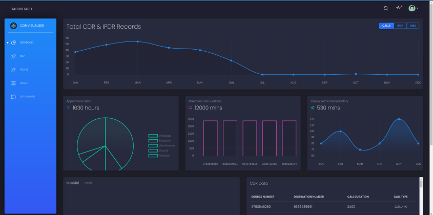
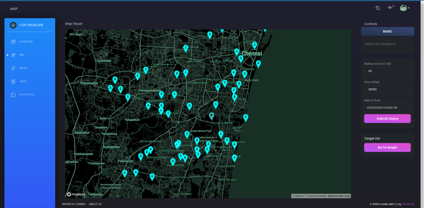
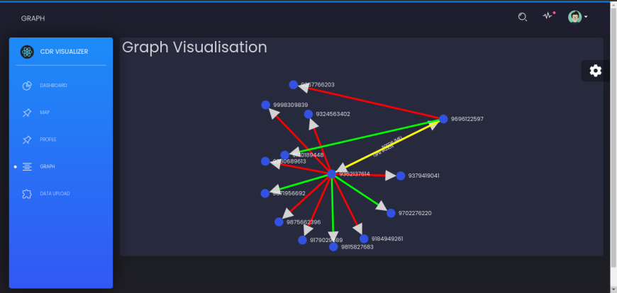
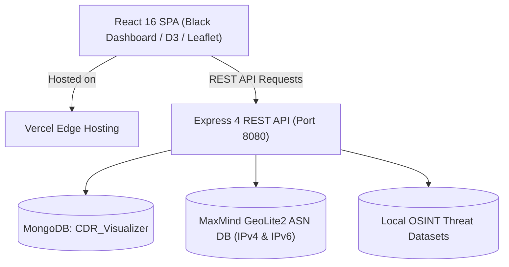

# SancharNetra (संचारनेत्र) 🛰️

[](https://ddn-police-stf-trace.vercel.app)
[](https://reactjs.org/)
[](https://nodejs.org/)
[](https://expressjs.com/)
[](https://www.mongodb.com/)
[](https://opensource.org/licenses/MIT)

> **Telecom & Internet Intelligence Analysis Platform for Law Enforcement**  
> Developed for **Dehradun Police Special Task Force (STF)** to streamline **Call Detail Record (CDR)** analysis, **Internet Protocol Detail Record (IPDR)** tracking, and **VoIP / WhatsApp call correlation**.

🌐 **Live Frontend Deployment:** [https://ddn-police-stf-trace.vercel.app](https://ddn-police-stf-trace.vercel.app)

---

## 📌 Visual Highlights

| Executive Dashboard | Cell Tower Geospatial Tracking | Link Analysis / Suspect Graph |
|:---:|:---:|:---:|
|  |  |  |
| *High-level overview of calls, data, and cases* | *Interactive Leaflet GIS cell tower movement & heatmaps* | *D3 force-directed relationship network* |

---

## 🚀 Key Modules & Capabilities

### 1. 📞 Call Detail Records (CDR) Analysis
- **CSV Ingestion & Validation:** Automatically handles inconsistent carrier schemas (Airtel, Jio, Vi, BSNL).
- **Network Visualizer:** Interactive force-directed D3 graphs mapping caller-callee interactions and shared nodes.
- **Geospatial Movement Reconstruction:** Visualizes subscriber location changes chronologically with tower dwell-time analysis and route lines.
- **SIM Swap Detector:** Flags rapid IMSI/IMEI changes associated with handset hijacking and cybercrime.
- **Common Number Finder:** Cross-examines multiple suspect CDRs to identify common confederates and drop numbers.

### 2. 🌐 IP Detail Records (IPDR) & Anonymization Detection
- **VPN / Tor / Proxy Detection:** Matches ISP session logs against real-time Tor directory nodes, public proxies, and major VPN ranges (ProtonVPN, NordVPN, ExpressVPN).
- **Cloud Datacenter Identification:** Flags traffic destined for AWS, DigitalOcean, Cloudflare, OVH, and Azure servers.
- **Port Intelligence:** Automatically categorizes service ports into risk categories (High/Medium/Low) based on traffic protocols.

### 3. 💬 WhatsApp & VoIP Packet Correlation
- **Algorithmic Peer Dedication:** Employs bidirectional UDP packet correlation on WhatsApp relay server ranges (`31.13.*`, `157.240.*`), STUN NAT traversal ports (`3478`), and RTP/SRTP VoIP media ports (`50000–60000`).
- **Time-Window Matching:** Correlates Party A and candidate Party B connections within a calibrated $\Delta t \le 5\text{s}$ envelope to deduce call counterparts.
- **Confidence Scoring:** Generates an empirical confidence rating (60%–95%) with forensic rationale for legal presentation.
- 📖 *For detailed equations, see the [IPDR Correlation Methodology Document](IPDR_CORRELATION_METHODOLOGY.md).*

### 4. 🗃️ Intelligence Profiling & Threat Dossiers
- Unified threat search querying Phone numbers, Emails, and Social Media usernames.
- Local breach intelligence integration (`UPPCL`, `CollegeDekho`, `Instagram OSINT`) compiling a unified suspect dossier with graceful degradation.

### 5. 📁 Case Management System
- Segregated case numbers, suspect lists, investigating officer assignment, notes, and cross-case suspect overlap identification.

---

## 🛠️ Architecture & Tech Stack



- **Frontend:** React 16.13, Reactstrap (Bootstrap 4), `react-d3-graph`, `react-leaflet`, `chart.js`, Sass.
- **Backend:** Node.js, Express.js, Mongoose, Multer (streaming parser), `geoip-lite`, `maxmind`, JWT auth.
- **Database:** MongoDB (`CDR_Visualizer`).
- **Geo-Intelligence:** MaxMind GeoLite2 ASN Blocks (IPv4 & IPv6 included).

---

## ⚡ Quick Start Guide

### Prerequisites
- **Node.js** (v14+ / v18 recommended): `node -v`
- **MongoDB** (v4.4+): Ensure MongoDB daemon is running locally or provide a connection string.

### 1. Clone & Setup
```bash
git clone https://github.com/dhairyahuh/ddn-police-stf-trace.git
cd ddn-police-stf-trace
```

### 2. Configure Environment Files
Copy the example templates:
```bash
# Backend configuration
cp server/.env.example server/.env

# Frontend configuration
cp client/.env.example client/.env.local
```

### 3. Start MongoDB
- **macOS:** `brew services start mongodb-community`
- **Linux:** `sudo systemctl start mongod`
- **Windows:** `net start MongoDB`

### 4. Run Application

#### Automated (Windows)
Right-click `setup-and-run.ps1` and select **Run with PowerShell**.

#### Manual (macOS / Linux / Windows)
Open two terminal windows:

**Terminal 1 — Backend:**
```bash
cd server
npm install
npm start
# Server listens on port 8080 (http://localhost:8080)
```

**Terminal 2 — Frontend:**
```bash
cd client
npm install
npm start
# Opens dashboard at http://localhost:3000
```

---

## ⚙️ Environment Variables

### Backend (`server/.env`)
| Variable | Default | Description |
| :--- | :--- | :--- |
| `PORT` | `8080` | Express server port |
| `DB_NAME` | `CDR_Visualizer` | Target MongoDB database name |
| `MONGO_URI` | `mongodb://127.0.0.1:27017/CDR_Visualizer` | MongoDB connection URL |
| `BASE_URL` | `http://localhost:8080` | API canonical base URL |
| `JWT_SECRET` | `secret` | Secret for signing auth tokens |
| `LEAK_OSINT_API_TOKEN` | *(optional)* | External OSINT provider token |

### Frontend (`client/.env.local` / Vercel)
| Variable | Default | Description |
| :--- | :--- | :--- |
| `REACT_APP_API_URL` | `http://localhost:8080` | URL of the backend API service |
| `REACT_APP_MAP_BOX_TOKEN` | *(token)* | Mapbox access token for GIS maps |

---

## 📂 Project Structure

```
ddn-police-stf-trace/
├── client/                     # React 16 Web Dashboard
│   ├── src/
│   │   ├── components/         # CDR, IPDR, Case, Analytics widgets
│   │   ├── views/              # Dashboard, Maps, Graph, Profile, FileUpload
│   │   ├── services/           # API services & correlation helpers
│   │   └── config.js           # Dynamic BASE_URL config
│   ├── package.json
│   └── vercel.json             # Vercel SPA routing configuration
├── server/                     # Express.js REST API
│   ├── controllers/            # CDR, IPDR, Case, Correlation, Breach logic
│   ├── models/                 # Mongoose schemas (Calls, IP, Cases, Notes)
│   ├── routes/                 # Express routers
│   ├── utils/                  # Parsers, VPN detectors, GeoIP helpers
│   └── index.js                # Server entrypoint
├── resources/                  # Sample CDR & IPDR datasets for testing
├── cdrs/                       # Telecom CDR sample records
├── ipdrscdrs/                  # Combined IPDR/CDR test logs
├── helper_scripts/             # Synthetic data generators & test scripts
├── screenshots/                # Application preview images
├── GeoLite2-ASN-Blocks-IPv4.csv# MaxMind ASN IPv4 block mapping
├── GeoLite2-ASN-Blocks-IPv6.csv# MaxMind ASN IPv6 block mapping
├── IPDR_CORRELATION_METHODOLOGY.md   # Validated forensic algorithm documentation
├── POLICE_INVESTIGATION_ENHANCEMENTS.md # Technical roadmap & police recommendations
├── QUICK_START.md              # 5-minute setup instructions
├── latest.md                   # System release overview & patch notes
├── setup-and-run.ps1           # Windows one-click launcher
└── vercel.json                 # Monorepo deployment specification
```

---

## 📚 Technical Documentation

- 📄 [IPDR Correlation Methodology & Mathematics](IPDR_CORRELATION_METHODOLOGY.md)
- 📄 [Police Investigation Enhancement Recommendations](POLICE_INVESTIGATION_ENHANCEMENTS.md)
- 📄 [Quick Start Guide](QUICK_START.md)

---

## 🛡️ License

This project is licensed under the [MIT License](LICENSE.md).

Developed by **Team AlgoRhythm** for law enforcement telecom analytics.
